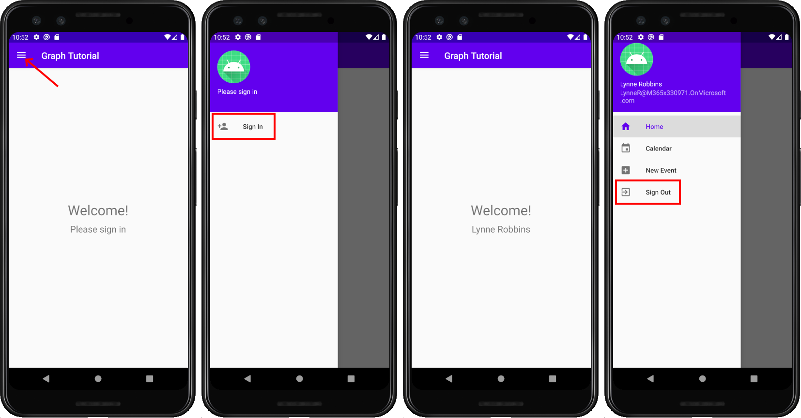

<!-- markdownlint-disable MD002 MD041 -->

<span data-ttu-id="08a72-101">Начните с создания нового проекта Android Studio.</span><span class="sxs-lookup"><span data-stu-id="08a72-101">Begin by creating a new Android Studio project.</span></span>

1. <span data-ttu-id="08a72-102">Откройте Android Studio и **выберите запуск нового проекта Android Studio** на экране приветствия.</span><span class="sxs-lookup"><span data-stu-id="08a72-102">Open Android Studio, and select **Start a new Android Studio project** on the welcome screen.</span></span>

1. <span data-ttu-id="08a72-103">В **диалоговом окте Create New Project** выберите **Пустое действие,** а затем выберите **Далее**.</span><span class="sxs-lookup"><span data-stu-id="08a72-103">In the **Create New Project** dialog, select **Empty Activity**, then select **Next**.</span></span>

    

1. <span data-ttu-id="08a72-105">В **диалоговом окте** "Настройка проекта" за установите имя, убедитесь, что поле Language установлено, и убедитесь, что минимальный уровень  `Graph Tutorial`  `Java` **API** `API 29: Android 10.0 (Q)` установлен.</span><span class="sxs-lookup"><span data-stu-id="08a72-105">In the **Configure your project** dialog, set the **Name** to `Graph Tutorial`, ensure the **Language** field is set to `Java`, and ensure the **Minimum API level** is set to `API 29: Android 10.0 (Q)`.</span></span> <span data-ttu-id="08a72-106">Измените **имя пакета и** **сохраните расположение по** мере необходимости.</span><span class="sxs-lookup"><span data-stu-id="08a72-106">Modify the **Package name** and **Save location** as needed.</span></span> <span data-ttu-id="08a72-107">Нажмите кнопку **Готово**.</span><span class="sxs-lookup"><span data-stu-id="08a72-107">Select **Finish**.</span></span>

    

> [!IMPORTANT]
> <span data-ttu-id="08a72-109">Код и инструкции в этом учебнике используют имя пакета **com.example.graphtutorial**.</span><span class="sxs-lookup"><span data-stu-id="08a72-109">The code and instructions in this tutorial use the package name **com.example.graphtutorial**.</span></span> <span data-ttu-id="08a72-110">Если при создании проекта используется другое имя пакета, обязательно используйте свое имя пакета, где бы вы ни увидели это значение.</span><span class="sxs-lookup"><span data-stu-id="08a72-110">If you use a different package name when creating the project, be sure to use your package name wherever you see this value.</span></span>

## <a name="install-dependencies"></a><span data-ttu-id="08a72-111">Установка зависимостей</span><span class="sxs-lookup"><span data-stu-id="08a72-111">Install dependencies</span></span>

<span data-ttu-id="08a72-112">Прежде чем двигаться дальше, установите дополнительные зависимости, которые вы будете использовать позже.</span><span class="sxs-lookup"><span data-stu-id="08a72-112">Before moving on, install some additional dependencies that you will use later.</span></span>

- <span data-ttu-id="08a72-113">`com.google.android.material:material` чтобы сделать [представление навигации](https://material.io/develop/android/components/navigation-view/) доступным для приложения.</span><span class="sxs-lookup"><span data-stu-id="08a72-113">`com.google.android.material:material` to make the [navigation view](https://material.io/develop/android/components/navigation-view/) available to the app.</span></span>
- <span data-ttu-id="08a72-114">[Microsoft Authentication Library (MSAL)](https://github.com/AzureAD/microsoft-authentication-library-for-android) для Android для обработки проверки подлинности Azure AD и управления маркерами.</span><span class="sxs-lookup"><span data-stu-id="08a72-114">[Microsoft Authentication Library (MSAL) for Android](https://github.com/AzureAD/microsoft-authentication-library-for-android) to handle Azure AD authentication and token management.</span></span>
- <span data-ttu-id="08a72-115">[Microsoft Graph SDK для Java](https://github.com/microsoftgraph/msgraph-sdk-java) для звонков в Microsoft Graph.</span><span class="sxs-lookup"><span data-stu-id="08a72-115">[Microsoft Graph SDK for Java](https://github.com/microsoftgraph/msgraph-sdk-java) for making calls to the Microsoft Graph.</span></span>

1. <span data-ttu-id="08a72-116">**Расширйте скрипты Gradle,** затем откройте **build.gradle (Модуль: Graph_Tutorial.app).**</span><span class="sxs-lookup"><span data-stu-id="08a72-116">Expand **Gradle Scripts**, then open **build.gradle (Module: Graph_Tutorial.app)**.</span></span>

1. <span data-ttu-id="08a72-117">Добавьте в значение следующие `dependencies` строки.</span><span class="sxs-lookup"><span data-stu-id="08a72-117">Add the following lines inside the `dependencies` value.</span></span>

    :::code language="gradle" source="../demo/GraphTutorial/app/build.gradle" id="DependenciesSnippet":::

1. <span data-ttu-id="08a72-118">Добавьте значение внутри значения `packagingOptions` `android` **build.gradle (Модуль: Graph_Tutorial.app).**</span><span class="sxs-lookup"><span data-stu-id="08a72-118">Add a `packagingOptions` value inside the `android` value in **build.gradle (Module: Graph_Tutorial.app)**.</span></span>

    ```Gradle
    packagingOptions {
        pickFirst 'META-INF/*'
    }
    ```

1. <span data-ttu-id="08a72-119">Добавьте репозиторий Azure Maven для библиотеки MicrosoftDeviceSDK, зависимой от MSAL.</span><span class="sxs-lookup"><span data-stu-id="08a72-119">Add the Azure Maven repository for the MicrosoftDeviceSDK library, a dependency of MSAL.</span></span> <span data-ttu-id="08a72-120">Откройте **build.gradle (Project: Graph_Tutorial).**</span><span class="sxs-lookup"><span data-stu-id="08a72-120">Open **build.gradle (Project: Graph_Tutorial)**.</span></span> <span data-ttu-id="08a72-121">Добавьте следующее значение `repositories` внутри `allprojects` значения.</span><span class="sxs-lookup"><span data-stu-id="08a72-121">Add the following to the `repositories` value inside the `allprojects` value.</span></span>

    ```Gradle
    maven {
        url 'https://pkgs.dev.azure.com/MicrosoftDeviceSDK/DuoSDK-Public/_packaging/Duo-SDK-Feed/maven/v1'
    }
    ```

1. <span data-ttu-id="08a72-122">Сохраните изменения.</span><span class="sxs-lookup"><span data-stu-id="08a72-122">Save your changes.</span></span> <span data-ttu-id="08a72-123">В меню **File** выберите **Sync Project с Gradle Files**.</span><span class="sxs-lookup"><span data-stu-id="08a72-123">On the **File** menu, select **Sync Project with Gradle Files**.</span></span>

## <a name="design-the-app"></a><span data-ttu-id="08a72-124">Проектирование приложения</span><span class="sxs-lookup"><span data-stu-id="08a72-124">Design the app</span></span>

<span data-ttu-id="08a72-125">Приложение будет использовать ящик навигации для перемещения между различными представлениями.</span><span class="sxs-lookup"><span data-stu-id="08a72-125">The application will use a navigation drawer to navigate between different views.</span></span> <span data-ttu-id="08a72-126">На этом шаге вы обновим действие, чтобы использовать макет ящика навигации и добавьте фрагменты для представлений.</span><span class="sxs-lookup"><span data-stu-id="08a72-126">In this step you will update the activity to use a navigation drawer layout, and add fragments for the views.</span></span>

### <a name="create-a-navigation-drawer"></a><span data-ttu-id="08a72-127">Создание ящика навигации</span><span class="sxs-lookup"><span data-stu-id="08a72-127">Create a navigation drawer</span></span>

<span data-ttu-id="08a72-128">В этом разделе вы создайте значки для меню навигации приложения, создайте меню для приложения и обновим тему и макет приложения, чтобы быть совместимыми с ящиком навигации.</span><span class="sxs-lookup"><span data-stu-id="08a72-128">In this section you will create icons for the app's navigation menu, create a menu for the application, and update the application's theme and layout to be compatible with a navigation drawer.</span></span>

#### <a name="create-icons"></a><span data-ttu-id="08a72-129">Создание значков</span><span class="sxs-lookup"><span data-stu-id="08a72-129">Create icons</span></span>

1. <span data-ttu-id="08a72-130">Щелкните правой кнопкой **мыши папку app/res/drawable** и выберите **New**, затем **Vector Asset**.</span><span class="sxs-lookup"><span data-stu-id="08a72-130">Right-click the **app/res/drawable** folder and select **New**, then **Vector Asset**.</span></span>

1. <span data-ttu-id="08a72-131">Нажмите кнопку значок рядом с **Clip Art**.</span><span class="sxs-lookup"><span data-stu-id="08a72-131">Click the icon button next to **Clip Art**.</span></span>

1. <span data-ttu-id="08a72-132">В **окне Выберите значок** введите в панели поиска, а затем `home` выберите значок **Главная** и выберите **ОК.**</span><span class="sxs-lookup"><span data-stu-id="08a72-132">In the **Select Icon** window, type `home` in the search bar, then select the **Home** icon and select **OK**.</span></span>

1. <span data-ttu-id="08a72-133">Измените **имя** `ic_menu_home` на .</span><span class="sxs-lookup"><span data-stu-id="08a72-133">Change the **Name** to `ic_menu_home`.</span></span>

    

1. <span data-ttu-id="08a72-135">Выберите **Далее**, а затем **закончить**.</span><span class="sxs-lookup"><span data-stu-id="08a72-135">Select **Next**, then **Finish**.</span></span>

1. <span data-ttu-id="08a72-136">Повторите предыдущий шаг, чтобы создать еще четыре значка.</span><span class="sxs-lookup"><span data-stu-id="08a72-136">Repeat the previous step to create four more icons.</span></span>

    - <span data-ttu-id="08a72-137">Имя: `ic_menu_calendar` , Значок: `event`</span><span class="sxs-lookup"><span data-stu-id="08a72-137">Name: `ic_menu_calendar`, Icon: `event`</span></span>
    - <span data-ttu-id="08a72-138">Имя: `ic_menu_add_event` , Значок: `add box`</span><span class="sxs-lookup"><span data-stu-id="08a72-138">Name: `ic_menu_add_event`, Icon: `add box`</span></span>
    - <span data-ttu-id="08a72-139">Имя: `ic_menu_signout` , Значок: `exit to app`</span><span class="sxs-lookup"><span data-stu-id="08a72-139">Name: `ic_menu_signout`, Icon: `exit to app`</span></span>
    - <span data-ttu-id="08a72-140">Имя: `ic_menu_signin` , Значок: `person add`</span><span class="sxs-lookup"><span data-stu-id="08a72-140">Name: `ic_menu_signin`, Icon: `person add`</span></span>

#### <a name="create-the-menu"></a><span data-ttu-id="08a72-141">Создание меню</span><span class="sxs-lookup"><span data-stu-id="08a72-141">Create the menu</span></span>

1. <span data-ttu-id="08a72-142">Щелкните правой кнопкой мыши **папку res** и выберите **New**, а затем **Каталог ресурсов Android**.</span><span class="sxs-lookup"><span data-stu-id="08a72-142">Right-click the **res** folder and select **New**, then **Android Resource Directory**.</span></span>

1. <span data-ttu-id="08a72-143">Измените **тип ресурса и** выберите `menu` **ОК.**</span><span class="sxs-lookup"><span data-stu-id="08a72-143">Change the **Resource type** to `menu` and select **OK**.</span></span>

1. <span data-ttu-id="08a72-144">Щелкните правой кнопкой мыши новую **папку меню** и выберите **Файл ресурсов** **Меню**.</span><span class="sxs-lookup"><span data-stu-id="08a72-144">Right-click the new **menu** folder and select **New**, then **Menu resource file**.</span></span>

1. <span data-ttu-id="08a72-145">Назови файл `drawer_menu` и выберите **ОК.**</span><span class="sxs-lookup"><span data-stu-id="08a72-145">Name the file `drawer_menu` and select **OK**.</span></span>

1. <span data-ttu-id="08a72-146">Когда файл откроется, выберите **вкладку Code** для просмотра XML, а затем замените все содержимое на следующее.</span><span class="sxs-lookup"><span data-stu-id="08a72-146">When the file opens, select the **Code** tab to view the XML, then replace the entire contents with the following.</span></span>

    :::code language="xml" source="../demo/GraphTutorial/app/src/main/res/menu/drawer_menu.xml":::

#### <a name="update-application-theme-and-layout"></a><span data-ttu-id="08a72-147">Обновление темы и макета приложений</span><span class="sxs-lookup"><span data-stu-id="08a72-147">Update application theme and layout</span></span>

1. <span data-ttu-id="08a72-148">Откройте **файл app/res/values/themes.xml** и добавьте в элемент следующие `style` строки.</span><span class="sxs-lookup"><span data-stu-id="08a72-148">Open the **app/res/values/themes.xml** file and add the following lines inside the `style` element.</span></span>

    ```xml
    <item name="windowActionBar">false</item>
    <item name="windowNoTitle">true</item>
    ```

1. <span data-ttu-id="08a72-149">Откройте **файл app/res/values-night/themes.xml** и добавьте в элемент следующие `style` строки.</span><span class="sxs-lookup"><span data-stu-id="08a72-149">Open the **app/res/values-night/themes.xml** file and add the following lines inside the `style` element.</span></span>

    ```xml
    <item name="windowActionBar">false</item>
    <item name="windowNoTitle">true</item>
    ```

1. <span data-ttu-id="08a72-150">Щелкните правой **кнопкой мыши папку app/res/layout.**</span><span class="sxs-lookup"><span data-stu-id="08a72-150">Right-click the **app/res/layout** folder.</span></span>

1. <span data-ttu-id="08a72-151">Выберите **новый,** затем **файл ресурсов Layout**.</span><span class="sxs-lookup"><span data-stu-id="08a72-151">Select **New**, then **Layout resource file**.</span></span>

1. <span data-ttu-id="08a72-152">Назови файл `nav_header` и измените **элемент Root на** , а затем выберите `LinearLayout` **ОК.**</span><span class="sxs-lookup"><span data-stu-id="08a72-152">Name the file `nav_header` and change the **Root element** to `LinearLayout`, then select **OK**.</span></span>

1. <span data-ttu-id="08a72-153">Откройте файл **nav_header.xml** и выберите вкладку **Code.** Замените все содержимое следующим.</span><span class="sxs-lookup"><span data-stu-id="08a72-153">Open the **nav_header.xml** file and select the **Code** tab. Replace the entire contents with the following.</span></span>

    :::code language="xml" source="../demo/GraphTutorial/app/src/main/res/layout/nav_header.xml":::

1. <span data-ttu-id="08a72-154">Откройте **файл app/res/layout/activity_main.xml** и обнови макет на макет, заменив существующий `DrawerLayout` XML следующим.</span><span class="sxs-lookup"><span data-stu-id="08a72-154">Open the **app/res/layout/activity_main.xml** file and update the layout to a `DrawerLayout` by replacing the existing XML with the following.</span></span>

    :::code language="xml" source="../demo/GraphTutorial/app/src/main/res/layout/activity_main.xml":::

1. <span data-ttu-id="08a72-155">Откройте **приложение/res/values/strings.xml** и добавьте в элемент следующие `resources` элементы.</span><span class="sxs-lookup"><span data-stu-id="08a72-155">Open **app/res/values/strings.xml** and add the following elements inside the `resources` element.</span></span>

    ```xml
    <string name="navigation_drawer_open">Open navigation drawer</string>
    <string name="navigation_drawer_close">Close navigation drawer</string>
    ```

1. <span data-ttu-id="08a72-156">Откройте файл **app/java/com.example/graphtutorial/MainActivity** и замените все содержимое следующим.</span><span class="sxs-lookup"><span data-stu-id="08a72-156">Open the **app/java/com.example/graphtutorial/MainActivity** file and replace the entire contents with the following.</span></span>

    ```java
    package com.example.graphtutorial;

    import android.os.Bundle;
    import android.view.Menu;
    import android.view.MenuItem;
    import android.view.View;
    import android.widget.FrameLayout;
    import android.widget.ProgressBar;
    import android.widget.TextView;
    import androidx.annotation.NonNull;
    import androidx.appcompat.app.ActionBarDrawerToggle;
    import androidx.appcompat.app.AppCompatActivity;
    import androidx.appcompat.widget.Toolbar;
    import androidx.core.view.GravityCompat;
    import androidx.drawerlayout.widget.DrawerLayout;
    import com.google.android.material.navigation.NavigationView;

    public class MainActivity extends AppCompatActivity implements NavigationView.OnNavigationItemSelectedListener {
        private static final String SAVED_IS_SIGNED_IN = "isSignedIn";
        private static final String SAVED_USER_NAME = "userName";
        private static final String SAVED_USER_EMAIL = "userEmail";
        private static final String SAVED_USER_TIMEZONE = "userTimeZone";

        private DrawerLayout mDrawer;
        private NavigationView mNavigationView;
        private View mHeaderView;
        private boolean mIsSignedIn = false;
        private String mUserName = null;
        private String mUserEmail = null;
        private String mUserTimeZone = null;

        @Override
        protected void onCreate(Bundle savedInstanceState) {
            super.onCreate(savedInstanceState);
            setContentView(R.layout.activity_main);

            // Set the toolbar
            Toolbar toolbar = findViewById(R.id.toolbar);
            setSupportActionBar(toolbar);

            mDrawer = findViewById(R.id.drawer_layout);

            // Add the hamburger menu icon
            ActionBarDrawerToggle toggle = new ActionBarDrawerToggle(this, mDrawer, toolbar,
                    R.string.navigation_drawer_open, R.string.navigation_drawer_close);
            mDrawer.addDrawerListener(toggle);
            toggle.syncState();

            mNavigationView = findViewById(R.id.nav_view);

            // Set user name and email
            mHeaderView = mNavigationView.getHeaderView(0);
            setSignedInState(mIsSignedIn);

            // Listen for item select events on menu
            mNavigationView.setNavigationItemSelectedListener(this);

            if (savedInstanceState == null) {
                // Load the home fragment by default on startup
                openHomeFragment(mUserName);
            } else {
                // Restore state
                mIsSignedIn = savedInstanceState.getBoolean(SAVED_IS_SIGNED_IN);
                mUserName = savedInstanceState.getString(SAVED_USER_NAME);
                mUserEmail = savedInstanceState.getString(SAVED_USER_EMAIL);
                mUserTimeZone = savedInstanceState.getString(SAVED_USER_TIMEZONE);
                setSignedInState(mIsSignedIn);
            }
        }

        @Override
        protected void onSaveInstanceState(@NonNull Bundle outState) {
            super.onSaveInstanceState(outState);
            outState.putBoolean(SAVED_IS_SIGNED_IN, mIsSignedIn);
            outState.putString(SAVED_USER_NAME, mUserName);
            outState.putString(SAVED_USER_EMAIL, mUserEmail);
            outState.putString(SAVED_USER_TIMEZONE, mUserTimeZone);
        }

        @Override
        public boolean onNavigationItemSelected(@NonNull MenuItem menuItem) {
            // TEMPORARY
            return false;
        }

        @Override
        public void onBackPressed() {
            if (mDrawer.isDrawerOpen(GravityCompat.START)) {
                mDrawer.closeDrawer(GravityCompat.START);
            } else {
                super.onBackPressed();
            }
        }

        public void showProgressBar()
        {
            FrameLayout container = findViewById(R.id.fragment_container);
            ProgressBar progressBar = findViewById(R.id.progressbar);
            container.setVisibility(View.GONE);
            progressBar.setVisibility(View.VISIBLE);
        }

        public void hideProgressBar()
        {
            FrameLayout container = findViewById(R.id.fragment_container);
            ProgressBar progressBar = findViewById(R.id.progressbar);
            progressBar.setVisibility(View.GONE);
            container.setVisibility(View.VISIBLE);
        }

        // Update the menu and get the user's name and email
        private void setSignedInState(boolean isSignedIn) {
            mIsSignedIn = isSignedIn;

            mNavigationView.getMenu().clear();
            mNavigationView.inflateMenu(R.menu.drawer_menu);

            Menu menu = mNavigationView.getMenu();

            // Hide/show the Sign in, Calendar, and Sign Out buttons
            if (isSignedIn) {
                menu.removeItem(R.id.nav_signin);
            } else {
                menu.removeItem(R.id.nav_home);
                menu.removeItem(R.id.nav_calendar);
                menu.removeItem(R.id.nav_create_event);
                menu.removeItem(R.id.nav_signout);
            }

            // Set the user name and email in the nav drawer
            TextView userName = mHeaderView.findViewById(R.id.user_name);
            TextView userEmail = mHeaderView.findViewById(R.id.user_email);

            if (isSignedIn) {
                // For testing
                mUserName = "Lynne Robbins";
                mUserEmail = "lynner@contoso.com";
                mUserTimeZone = "Pacific Standard Time";

                userName.setText(mUserName);
                userEmail.setText(mUserEmail);
            } else {
                mUserName = null;
                mUserEmail = null;
                mUserTimeZone = null;

                userName.setText("Please sign in");
                userEmail.setText("");
            }
        }
    }
    ```

### <a name="add-fragments"></a><span data-ttu-id="08a72-157">Добавление фрагментов</span><span class="sxs-lookup"><span data-stu-id="08a72-157">Add fragments</span></span>

<span data-ttu-id="08a72-158">В этом разделе будут создаваться фрагменты для представлений дома и календаря.</span><span class="sxs-lookup"><span data-stu-id="08a72-158">In this section you will create fragments for the home and calendar views.</span></span>

1. <span data-ttu-id="08a72-159">Щелкните правой кнопкой **мыши папку app/res/layout** и выберите **файл ресурса "Новый"** и **"Макет".**</span><span class="sxs-lookup"><span data-stu-id="08a72-159">Right-click the **app/res/layout** folder and select **New**, then **Layout resource file**.</span></span>

1. <span data-ttu-id="08a72-160">Назови файл `fragment_home` и измените **элемент Root на** , а затем выберите `RelativeLayout` **ОК.**</span><span class="sxs-lookup"><span data-stu-id="08a72-160">Name the file `fragment_home` and change the **Root element** to `RelativeLayout`, then select **OK**.</span></span>

1. <span data-ttu-id="08a72-161">Откройте файл **fragment_home.xml** и замените его содержимое следующим.</span><span class="sxs-lookup"><span data-stu-id="08a72-161">Open the **fragment_home.xml** file and replace its contents with the following.</span></span>

    :::code language="xml" source="../demo/GraphTutorial/app/src/main/res/layout/fragment_home.xml":::

1. <span data-ttu-id="08a72-162">Щелкните правой кнопкой **мыши папку app/res/layout** и выберите **файл ресурса "Новый"** и **"Макет".**</span><span class="sxs-lookup"><span data-stu-id="08a72-162">Right-click the **app/res/layout** folder and select **New**, then **Layout resource file**.</span></span>

1. <span data-ttu-id="08a72-163">Назови файл `fragment_calendar` и измените **элемент Root на** , а затем выберите `RelativeLayout` **ОК.**</span><span class="sxs-lookup"><span data-stu-id="08a72-163">Name the file `fragment_calendar` and change the **Root element** to `RelativeLayout`, then select **OK**.</span></span>

1. <span data-ttu-id="08a72-164">Откройте файл **fragment_calendar.xml** и замените его содержимое следующим.</span><span class="sxs-lookup"><span data-stu-id="08a72-164">Open the **fragment_calendar.xml** file and replace its contents with the following.</span></span>

    ```xml
    <?xml version="1.0" encoding="utf-8"?>
    <RelativeLayout xmlns:android="http://schemas.android.com/apk/res/android"
        android:layout_width="match_parent"
        android:layout_height="match_parent">

        <TextView
            android:layout_width="wrap_content"
            android:layout_height="wrap_content"
            android:layout_centerInParent="true"
            android:text="Calendar"
            android:textSize="30sp" />

    </RelativeLayout>
    ```

1. <span data-ttu-id="08a72-165">Щелкните правой кнопкой **мыши папку app/res/layout** и выберите **файл ресурса "Новый"** и **"Макет".**</span><span class="sxs-lookup"><span data-stu-id="08a72-165">Right-click the **app/res/layout** folder and select **New**, then **Layout resource file**.</span></span>

1. <span data-ttu-id="08a72-166">Назови файл `fragment_new_event` и измените **элемент Root на** , а затем выберите `RelativeLayout` **ОК.**</span><span class="sxs-lookup"><span data-stu-id="08a72-166">Name the file `fragment_new_event` and change the **Root element** to `RelativeLayout`, then select **OK**.</span></span>

1. <span data-ttu-id="08a72-167">Откройте файл **fragment_new_event.xml** и замените его содержимое следующим.</span><span class="sxs-lookup"><span data-stu-id="08a72-167">Open the **fragment_new_event.xml** file and replace its contents with the following.</span></span>

    ```xml
    <?xml version="1.0" encoding="utf-8"?>
    <RelativeLayout xmlns:android="http://schemas.android.com/apk/res/android"
        android:layout_width="match_parent"
        android:layout_height="match_parent">

        <TextView
            android:layout_width="wrap_content"
            android:layout_height="wrap_content"
            android:layout_centerInParent="true"
            android:text="New Event"
            android:textSize="30sp" />

    </RelativeLayout>
    ```

1. <span data-ttu-id="08a72-168">Щелкните правой кнопкой **мыши приложение/java/com.example.graphtutorial** папку и выберите **New**, а затем **Java Class**.</span><span class="sxs-lookup"><span data-stu-id="08a72-168">Right-click the **app/java/com.example.graphtutorial** folder and select **New**, then **Java Class**.</span></span>

1. <span data-ttu-id="08a72-169">Назови `HomeFragment` класс, а затем выберите **ОК.**</span><span class="sxs-lookup"><span data-stu-id="08a72-169">Name the class `HomeFragment`, then select **OK**.</span></span>

1. <span data-ttu-id="08a72-170">Откройте файл **HomeFragment** и замените его содержимое следующим.</span><span class="sxs-lookup"><span data-stu-id="08a72-170">Open the **HomeFragment** file and replace its contents with the following.</span></span>

    :::code language="java" source="../demo/GraphTutorial/app/src/main/java/com/example/graphtutorial/HomeFragment.java" id="HomeSnippet":::

1. <span data-ttu-id="08a72-171">Щелкните правой кнопкой **мыши приложение/java/com.example.graphtutorial** папку и выберите **New**, а затем **Java Class**.</span><span class="sxs-lookup"><span data-stu-id="08a72-171">Right-click the **app/java/com.example.graphtutorial** folder and select **New**, then **Java Class**.</span></span>

1. <span data-ttu-id="08a72-172">Назови `CalendarFragment` класс, а затем выберите **ОК.**</span><span class="sxs-lookup"><span data-stu-id="08a72-172">Name the class `CalendarFragment`, then select **OK**.</span></span>

1. <span data-ttu-id="08a72-173">Откройте **файл CalendarFragment** и замените его содержимое следующим.</span><span class="sxs-lookup"><span data-stu-id="08a72-173">Open the **CalendarFragment** file and replace its contents with the following.</span></span>

    ```java
    package com.example.graphtutorial;

    import android.os.Bundle;
    import android.view.LayoutInflater;
    import android.view.View;
    import android.view.ViewGroup;
    import androidx.annotation.NonNull;
    import androidx.annotation.Nullable;
    import androidx.fragment.app.Fragment;

    public class CalendarFragment extends Fragment {
        private static final String TIME_ZONE = "timeZone";

        private String mTimeZone;

        public CalendarFragment() {}

        public static CalendarFragment createInstance(String timeZone) {
            CalendarFragment fragment = new CalendarFragment();

            // Add the provided time zone to the fragment's arguments
            Bundle args = new Bundle();
            args.putString(TIME_ZONE, timeZone);
            fragment.setArguments(args);
            return fragment;
        }

        @Override
        public void onCreate(@Nullable Bundle savedInstanceState) {
            super.onCreate(savedInstanceState);
            if (getArguments() != null) {
                mTimeZone = getArguments().getString(TIME_ZONE);
            }
        }

        @Nullable
        @Override
        public View onCreateView(@NonNull LayoutInflater inflater, @Nullable ViewGroup container, @Nullable Bundle savedInstanceState) {
            return inflater.inflate(R.layout.fragment_calendar, container, false);
        }
    }
    ```

1. <span data-ttu-id="08a72-174">Щелкните правой кнопкой **мыши приложение/java/com.example.graphtutorial** папку и выберите **New**, а затем **Java Class**.</span><span class="sxs-lookup"><span data-stu-id="08a72-174">Right-click the **app/java/com.example.graphtutorial** folder and select **New**, then **Java Class**.</span></span>

1. <span data-ttu-id="08a72-175">Назови `NewEventFragment` класс, а затем выберите **ОК.**</span><span class="sxs-lookup"><span data-stu-id="08a72-175">Name the class `NewEventFragment`, then select **OK**.</span></span>

1. <span data-ttu-id="08a72-176">Откройте файл **NewEventFragment** и замените его содержимое следующим.</span><span class="sxs-lookup"><span data-stu-id="08a72-176">Open the **NewEventFragment** file and replace its contents with the following.</span></span>

    ```java
    package com.example.graphtutorial;

    import android.os.Bundle;
    import android.view.LayoutInflater;
    import android.view.View;
    import android.view.ViewGroup;
    import androidx.annotation.NonNull;
    import androidx.annotation.Nullable;
    import androidx.fragment.app.Fragment;

    public class NewEventFragment extends Fragment {
        private static final String TIME_ZONE = "timeZone";

        private String mTimeZone;

        public NewEventFragment() {}

        public static NewEventFragment createInstance(String timeZone) {
            NewEventFragment fragment = new NewEventFragment();

            // Add the provided time zone to the fragment's arguments
            Bundle args = new Bundle();
            args.putString(TIME_ZONE, timeZone);
            fragment.setArguments(args);
            return fragment;
        }

        @Override
        public void onCreate(@Nullable Bundle savedInstanceState) {
            super.onCreate(savedInstanceState);
            if (getArguments() != null) {
                mTimeZone = getArguments().getString(TIME_ZONE);
            }
        }

        @Nullable
        @Override
        public View onCreateView(@NonNull LayoutInflater inflater, @Nullable ViewGroup container, @Nullable Bundle savedInstanceState) {
            return inflater.inflate(R.layout.fragment_new_event, container, false);
        }
    }
    ```

1. <span data-ttu-id="08a72-177">Откройте файл **MainActivity.java** и добавьте в класс следующие функции.</span><span class="sxs-lookup"><span data-stu-id="08a72-177">Open the **MainActivity.java** file and add the the following functions to the class.</span></span>

    ```java
    // Load the "Home" fragment
    public void openHomeFragment(String userName) {
        HomeFragment fragment = HomeFragment.createInstance(userName);
        getSupportFragmentManager().beginTransaction()
                .replace(R.id.fragment_container, fragment)
                .commit();
        mNavigationView.setCheckedItem(R.id.nav_home);
    }

    // Load the "Calendar" fragment
    private void openCalendarFragment(String timeZone) {
        CalendarFragment fragment = CalendarFragment.createInstance(timeZone);
        getSupportFragmentManager().beginTransaction()
                .replace(R.id.fragment_container, fragment)
                .commit();
        mNavigationView.setCheckedItem(R.id.nav_calendar);
    }

    // Load the "New Event" fragment
    private void openNewEventFragment(String timeZone) {
        NewEventFragment fragment = NewEventFragment.createInstance(timeZone);
        getSupportFragmentManager().beginTransaction()
                .replace(R.id.fragment_container, fragment)
                .commit();
        mNavigationView.setCheckedItem(R.id.nav_create_event);
    }

    private void signIn() {
        setSignedInState(true);
        openHomeFragment(mUserName);
    }

    private void signOut() {
        setSignedInState(false);
        openHomeFragment(mUserName);
    }
    ```

1. <span data-ttu-id="08a72-178">Замените имеющуюся функцию `onNavigationItemSelected` указанным ниже кодом.</span><span class="sxs-lookup"><span data-stu-id="08a72-178">Replace the existing `onNavigationItemSelected` function with the following.</span></span>

    :::code language="java" source="../demo/GraphTutorial/app/src/main/java/com/example/graphtutorial/MainActivity.java" id="OnNavItemSelectedSnippet":::

1. <span data-ttu-id="08a72-179">Сохраните все изменения.</span><span class="sxs-lookup"><span data-stu-id="08a72-179">Save all of your changes.</span></span>

1. <span data-ttu-id="08a72-180">В меню **Run** выберите **выполнить "приложение".**</span><span class="sxs-lookup"><span data-stu-id="08a72-180">On the **Run** menu, select **Run 'app'**.</span></span>

<span data-ttu-id="08a72-181">Меню приложения должно работать для перемещения между двумя фрагментами и изменения при нажатии кнопки **Вход** или **Вход.**</span><span class="sxs-lookup"><span data-stu-id="08a72-181">The app's menu should work to navigate between the two fragments and change when you tap the **Sign in** or **Sign out** buttons.</span></span>


