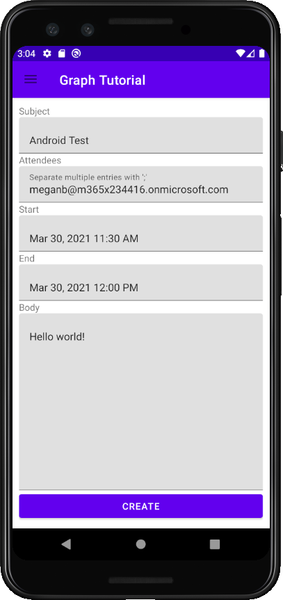

<!-- markdownlint-disable MD002 MD041 -->

В этом разделе вы добавим возможность создания событий в календаре пользователя.

1. Откройте **GraphHelper** и добавьте следующие утверждения в `import` верхнюю часть файла.

    ```java
    import com.microsoft.graph.models.extensions.Attendee;
    import com.microsoft.graph.models.extensions.DateTimeTimeZone;
    import com.microsoft.graph.models.extensions.EmailAddress;
    import com.microsoft.graph.models.extensions.ItemBody;
    import com.microsoft.graph.models.generated.AttendeeType;
    import com.microsoft.graph.models.generated.BodyType;
    ```

1. Добавьте в класс следующую `GraphHelper` функцию, чтобы создать новое событие.

    :::code language="java" source="../demo/GraphTutorial/app/src/main/java/com/example/graphtutorial/GraphHelper.java" id="CreateEventSnippet":::

## <a name="update-new-event-fragment"></a>Обновление нового фрагмента события

1. Щелкните правой кнопкой мыши папку **app/java/com.example.graphtutorial** и выберите **"Новый",** затем **"Класс Java".** Назовем класс `EditTextDateTimePicker` и выберите **"ОК".**

1. Откройте новый файл и замените его содержимое следующим:

    :::code language="java" source="../demo/GraphTutorial/app/src/main/java/com/example/graphtutorial/EditTextDateTimePicker.java" id="DateTimePickerSnippet":::

    Этот класс обтекает этот класс, показывает выбор даты и времени, когда пользователь нажми его, и обновляет значение с помощью даты `EditText` и времени.

1. Откройте **приложение,res/layout/fragment_new_event.xml** замените его содержимое на следующее.

    :::code language="xml" source="../demo/GraphTutorial/app/src/main/res/layout/fragment_new_event.xml":::

1. Откройте **NewEventFragment** и добавьте следующие утверждения в `import` верхней части файла.

    ```java
    import android.util.Log;
    import android.widget.Button;
    import com.google.android.material.snackbar.BaseTransientBottomBar;
    import com.google.android.material.snackbar.Snackbar;
    import com.google.android.material.textfield.TextInputLayout;
    import com.microsoft.graph.concurrency.ICallback;
    import com.microsoft.graph.core.ClientException;
    import com.microsoft.graph.models.extensions.Event;
    import com.microsoft.identity.client.AuthenticationCallback;
    import com.microsoft.identity.client.IAuthenticationResult;
    import com.microsoft.identity.client.exception.MsalException;
    import java.time.ZoneId;
    import java.time.ZonedDateTime;
    ```

1. Добавьте в класс следующие `NewEventFragment` члены.

    :::code language="java" source="../demo/GraphTutorial/app/src/main/java/com/example/graphtutorial/NewEventFragment.java" id="InputsSnippet":::

1. Добавьте следующие функции, чтобы показать и скрыть ход выполнения.

    :::code language="java" source="../demo/GraphTutorial/app/src/main/java/com/example/graphtutorial/NewEventFragment.java" id="ProgressBarSnippet":::

1. Добавьте следующие функции, чтобы получить значения из элементов управления вводом и вызвать `GraphHelper.createEvent` функцию.

    :::code language="java" source="../demo/GraphTutorial/app/src/main/java/com/example/graphtutorial/NewEventFragment.java" id="CreateEventSnippet":::

1. Замените `onCreateView` существующее на следующее.

    :::code language="java" source="../demo/GraphTutorial/app/src/main/java/com/example/graphtutorial/NewEventFragment.java" id="OnCreateViewSnippet":::

1. Сохраните изменения и перезапустите приложение. Выберите пункт **меню "Создать событие",** заполните форму и выберите **"СОЗДАТЬ".**

    
