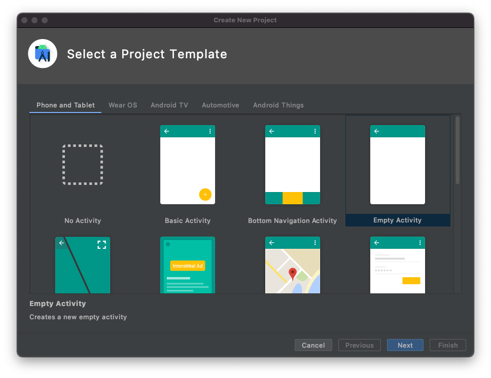

<!-- markdownlint-disable MD002 MD041 -->

Откройте Android Studio и выберите **начать новый проект Android Studio** на экране приветствия. В диалоговом окне **Создание нового проекта** выберите **пустое действие**, а затем нажмите кнопку **Далее**.



В диалоговом окне **Настройка проекта** укажите **имя** `Graph Tutorial`, убедитесь, что для `Java`поля **язык** задано значение, а для `API 27: Android 8.1 (Oreo)`параметра **минимальный уровень API** задано значение. Измените **имя пакета** и **сохраните расположение** по мере необходимости. Нажмите кнопку **Готово**.


> [!IMPORTANT]
> Убедитесь, что вы вводите точно такое же имя проекта, которое указано в данных инструкциях лаборатории. Имя проекта становится частью пространства имен в коде. Код в этих инструкциях зависит от пространства имен, которое соответствует имени проекта, указанному в этих инструкциях. Если вы используете другое имя проекта, код не будет компилироваться, если не настроить все пространства имен так, чтобы они соотнесены с именем проекта, вводимым при создании проекта.

Перед перемещением установите некоторые дополнительные зависимости, которые будут использоваться позже.

- `com.android.support:design`чтобы сделать макеты лотков навигации доступными для приложения.
- [Библиотека проверки ПодлиннОсти Microsoft (MSAL) для Android](https://github.com/AzureAD/microsoft-authentication-library-for-android) для обработки проверки подлинности и управления маркерами Azure AD.
- [Пакет SDK Microsoft Graph для Java](https://github.com/microsoftgraph/msgraph-sdk-java) для совершения вызовов в Microsoft Graph.

Разверните узел **сценарии Gradle**, а затем откройте файл **Build. Gradle (Module: App)** . Добавьте следующие строки в `dependencies` значение.

```Gradle
implementation 'com.android.support:design:28.0.0'
implementation 'com.microsoft.graph:microsoft-graph:1.1.+'
implementation 'com.microsoft.identity.client:msal:0.2.+'
```

> [!NOTE]
> Если вы используете другую версию пакета SDK, обязательно измените значение в поле `28.0.0` в соответствие с версией `com.android.support:appcompat-v7` зависимости, которая уже присутствует в файле **Build. gradle**.

Добавьте `packagingOptions` внутреннее `android` значение в файл **Build. gradle (Module: App)** .

```Gradle
packagingOptions {
    pickFirst 'META-INF/jersey-module-version'
}
```

Сохраните изменения. В меню **файл** выберите команду **синхронизировать проект с файлами Gradle**.

## <a name="design-the-app"></a>Проектирование приложения

Приложение будет использовать [входной ящик для навигации](https://developer.android.com/training/implementing-navigation/nav-drawer) по разным представлениям. На этом этапе вы обновите действие, чтобы оно использовало макет ящика навигации, и добавьте фрагменты для представлений.

### <a name="create-a-navigation-drawer"></a>Создание ящика навигации

Начните с создания значков для меню навигации приложения. Щелкните правой кнопкой мыши папку **app/RES/Draw** и выберите **создать**, затем **Векторный ресурс**. Нажмите кнопку со значком рядом с элементом **Коллекция картинок**. В окне **Выбор значка** введите текст `home` в строке поиска, а затем щелкните значок " **домой** " и нажмите кнопку **ОК**. Измените **имя** на `ic_menu_home`.


Нажмите кнопку **Далее**, а затем кнопку **Готово**. Повторите это действие, чтобы создать еще два значка.

- Name: `ic_menu_calendar`, Icon:`event`
- Name: `ic_menu_signout`, Icon:`exit to app`
- Name: `ic_menu_signin`, Icon:`person add`

Затем создайте меню для приложения. Щелкните правой кнопкой мыши папку **RES** и выберите команду **создать**, а затем **Каталог ресурсов Android**. Измените **тип ресурса** на `menu` и нажмите кнопку **ОК**.

Щелкните правой кнопкой мыши новую папку **меню** и выберите команду **создать**, а затем — **файл ресурсов меню**. ПриСвойте файлу `drawer_menu` имя и нажмите кнопку **ОК**. Когда откроется файл, выберите вкладку **текст** для просмотра XML и замените все содержимое приведенным ниже.

```xml
<?xml version="1.0" encoding="utf-8"?>
<menu xmlns:android="http://schemas.android.com/apk/res/android"
    xmlns:tools="http://schemas.android.com/tools"
    tools:showIn="navigation_view">

    <group android:checkableBehavior="single">
        <item
            android:id="@+id/nav_home"
            android:icon="@drawable/ic_menu_home"
            android:title="Home" />

        <item
            android:id="@+id/nav_calendar"
            android:icon="@drawable/ic_menu_calendar"
            android:title="Calendar" />
    </group>

    <item android:title="Account">
        <menu>
            <item
                android:id="@+id/nav_signin"
                android:icon="@drawable/ic_menu_signin"
                android:title="Sign In" />

            <item
                android:id="@+id/nav_signout"
                android:icon="@drawable/ic_menu_signout"
                android:title="Sign Out" />
        </menu>
    </item>

</menu>
```

Теперь обновите тему приложения, чтобы обеспечить совместимость с ящиком навигации. Откройте файл **app/RES/Values/Styles. XML** . Замените `Theme.AppCompat.Light.DarkActionBar` на `Theme.AppCompat.Light.NoActionBar`. Затем добавьте следующие строки в `style` элемент.

```xml
<item name="windowActionBar">false</item>
<item name="windowNoTitle">true</item>
<item name="android:statusBarColor">@android:color/transparent</item>
```

Затем создайте заголовок меню. Щелкните правой кнопкой мыши папку **app/res/layout** . Выберите **создать**, а затем **файл ресурса макета**. ПриСвойте файлу `nav_header` имя и замените **корневой элемент** на `LinearLayout`. Нажмите кнопку **OK**.

Откройте файл **нав_хеадер. XML** и выберите вкладку **текст** . Замените все содержимое приведенным ниже.

```xml
<?xml version="1.0" encoding="utf-8"?>
<<?xml version="1.0" encoding="utf-8"?>
<LinearLayout xmlns:android="http://schemas.android.com/apk/res/android"
    android:layout_width="match_parent"
    android:layout_height="176dp"
    android:background="@color/colorPrimary"
    android:gravity="bottom"
    android:orientation="vertical"
    android:padding="16dp"
    android:theme="@style/ThemeOverlay.AppCompat.Dark">

    <ImageView
        android:id="@+id/user_profile_pic"
        android:layout_width="wrap_content"
        android:layout_height="wrap_content"
        android:src="@mipmap/ic_launcher" />

    <TextView
        android:id="@+id/user_name"
        android:layout_width="wrap_content"
        android:layout_height="wrap_content"
        android:paddingTop="8dp"
        android:text="Test User"
        android:textAppearance="@style/TextAppearance.AppCompat.Body1" />

    <TextView
        android:id="@+id/user_email"
        android:layout_width="wrap_content"
        android:layout_height="wrap_content"
        android:text="test@contoso.com" />

</LinearLayout>
```

Теперь откройте файл **app/res/layout/активити_маин. XML** . Измените макет на a `DrawerLayout` , заменив существующий XML приведенным ниже.

```xml
<?xml version="1.0" encoding="utf-8"?>
<android.support.v4.widget.DrawerLayout xmlns:android="http://schemas.android.com/apk/res/android"
    xmlns:app="http://schemas.android.com/apk/res-auto"
    xmlns:tools="http://schemas.android.com/tools"
    android:id="@+id/drawer_layout"
    android:layout_width="match_parent"
    android:layout_height="match_parent"
    android:fitsSystemWindows="true"
    tools:context=".MainActivity"
    tools:openDrawer="start">

    <RelativeLayout
        android:layout_width="match_parent"
        android:layout_height="match_parent"
        android:orientation="vertical">

        <ProgressBar
            android:id="@+id/progressbar"
            android:layout_width="75dp"
            android:layout_height="75dp"
            android:layout_centerInParent="true"
            android:visibility="gone"/>

        <android.support.v7.widget.Toolbar
            android:id="@+id/toolbar"
            android:layout_width="match_parent"
            android:layout_height="?attr/actionBarSize"
            android:background="@color/colorPrimary"
            android:elevation="4dp"
            android:theme="@style/ThemeOverlay.AppCompat.Dark.ActionBar" />

        <FrameLayout
            android:id="@+id/fragment_container"
            android:layout_width="match_parent"
            android:layout_height="match_parent"
            android:layout_below="@+id/toolbar" />
    </RelativeLayout>

    <android.support.design.widget.NavigationView
        android:id="@+id/nav_view"
        android:layout_width="wrap_content"
        android:layout_height="match_parent"
        android:layout_gravity="start"
        app:headerLayout="@layout/nav_header"
        app:menu="@menu/drawer_menu" />

</android.support.v4.widget.DrawerLayout>
```

Затем откройте **приложение/RES/Values/strings. XML**. Добавьте в `resources` элемент следующие элементы.

```xml
<string name="navigation_drawer_open">Open navigation drawer</string>
<string name="navigation_drawer_close">Close navigation drawer</string>
```

Наконец, откройте файл **app/Java/com. example/графтуториал/MainActivity** . Замените все содержимое приведенным ниже содержимым.

```java
package com.example.graphtutorial;

import android.support.annotation.NonNull;
import android.support.design.widget.NavigationView;
import android.support.v4.view.GravityCompat;
import android.support.v4.widget.DrawerLayout;
import android.support.v7.app.ActionBarDrawerToggle;
import android.support.v7.app.AppCompatActivity;
import android.os.Bundle;
import android.support.v7.widget.Toolbar;
import android.view.Menu;
import android.view.MenuItem;
import android.view.View;
import android.widget.TextView;

public class MainActivity extends AppCompatActivity implements NavigationView.OnNavigationItemSelectedListener {
    private DrawerLayout mDrawer;
    private NavigationView mNavigationView;
    private View mHeaderView;
    private boolean mIsSignedIn = false;
    private String mUserName = null;
    private String mUserEmail = null;

    @Override
    protected void onCreate(Bundle savedInstanceState) {
        super.onCreate(savedInstanceState);
        setContentView(R.layout.activity_main);

        // Set the toolbar
        Toolbar toolbar = findViewById(R.id.toolbar);
        setSupportActionBar(toolbar);

        mDrawer = findViewById(R.id.drawer_layout);

        // Add the hamburger menu icon
        ActionBarDrawerToggle toggle = new ActionBarDrawerToggle(this, mDrawer, toolbar,
                R.string.navigation_drawer_open, R.string.navigation_drawer_close);
        mDrawer.addDrawerListener(toggle);
        toggle.syncState();

        mNavigationView = findViewById(R.id.nav_view);

        // Set user name and email
        mHeaderView = mNavigationView.getHeaderView(0);
        setSignedInState(mIsSignedIn);

        // Listen for item select events on menu
        mNavigationView.setNavigationItemSelectedListener(this);
    }

    @Override
    public boolean onNavigationItemSelected(@NonNull MenuItem menuItem) {
        // TEMPORARY
        return false;
    }

    @Override
    public void onBackPressed() {
        if (mDrawer.isDrawerOpen(GravityCompat.START)) {
            mDrawer.closeDrawer(GravityCompat.START);
        } else {
            super.onBackPressed();
        }
    }

    public void showProgressBar()
    {
        FrameLayout container = findViewById(R.id.fragment_container);
        ProgressBar progressBar = findViewById(R.id.progressbar);
        container.setVisibility(View.GONE);
        progressBar.setVisibility(View.VISIBLE);
    }

    public void hideProgressBar()
    {
        FrameLayout container = findViewById(R.id.fragment_container);
        ProgressBar progressBar = findViewById(R.id.progressbar);
        progressBar.setVisibility(View.GONE);
        container.setVisibility(View.VISIBLE);
    }

    // Update the menu and get the user's name and email
    private void setSignedInState(boolean isSignedIn) {
        mIsSignedIn = isSignedIn;

        Menu menu = mNavigationView.getMenu();

        // Hide/show the Sign in, Calendar, and Sign Out buttons
        menu.findItem(R.id.nav_signin).setVisible(!isSignedIn);
        menu.findItem(R.id.nav_calendar).setVisible(isSignedIn);
        menu.findItem(R.id.nav_signout).setVisible(isSignedIn);

        // Set the user name and email in the nav drawer
        TextView userName = mHeaderView.findViewById(R.id.user_name);
        TextView userEmail = mHeaderView.findViewById(R.id.user_email);

        if (isSignedIn) {
            // For testing
            mUserName = "Megan Bowen";
            mUserEmail = "meganb@contoso.com";

            userName.setText(mUserName);
            userEmail.setText(mUserEmail);
        } else {
            mUserName = null;
            mUserEmail = null;

            userName.setText("Please sign in");
            userEmail.setText("");
        }
    }
}
```

### <a name="add-fragments"></a>Добавление фрагментов

Щелкните правой кнопкой мыши папку **app/res/layout** и выберите команду **создать**, а затем — **файл ресурсов макета**. ПриСвойте файлу `fragment_home` имя и замените **корневой элемент** на `RelativeLayout`. Нажмите кнопку **OK**.

Откройте файл **фрагмент_хоме. XML** и замените его содержимое на приведенный ниже код.

```xml
<?xml version="1.0" encoding="utf-8"?>
<RelativeLayout xmlns:android="http://schemas.android.com/apk/res/android"
    android:layout_width="match_parent"
    android:layout_height="match_parent">

    <LinearLayout
        android:layout_width="wrap_content"
        android:layout_height="wrap_content"
        android:layout_centerInParent="true"
        android:orientation="vertical">

        <TextView
            android:layout_width="wrap_content"
            android:layout_height="wrap_content"
            android:layout_gravity="center_horizontal"
            android:text="Welcome!"
            android:textSize="30sp" />

        <TextView
            android:id="@+id/home_page_username"
            android:layout_width="wrap_content"
            android:layout_height="wrap_content"
            android:layout_gravity="center_horizontal"
            android:paddingTop="8dp"
            android:text="Please sign in"
            android:textSize="20sp" />
    </LinearLayout>

</RelativeLayout>
```

Затем щелкните правой кнопкой мыши папку **app/res/layout** и выберите команду **создать**, а затем — **файл ресурсов макета**. ПриСвойте файлу `fragment_calendar` имя и замените **корневой элемент** на `RelativeLayout`. Нажмите кнопку **OK**.

Откройте файл **фрагмент_календар. XML** и замените его содержимое на приведенный ниже код.

```xml
<?xml version="1.0" encoding="utf-8"?>
<RelativeLayout xmlns:android="http://schemas.android.com/apk/res/android"
    android:layout_width="match_parent"
    android:layout_height="match_parent">

    <TextView
        android:layout_width="wrap_content"
        android:layout_height="wrap_content"
        android:layout_centerInParent="true"
        android:text="Calendar"
        android:textSize="30sp" />

</RelativeLayout>
```

Теперь щелкните правой кнопкой мыши папку **app/Java/com. example. графтуториал** и выберите команду **создать**, а затем — **класс Java**. Присвойте классу `HomeFragment` имя и присвойте `android.support.v4.app.Fragment` **суперклассу** значение. Нажмите кнопку **OK**. Откройте файл **хомефрагмент** и замените его содержимое на приведенный ниже код.

```java
package com.example.graphtutorial;

import android.os.Bundle;
import android.support.annotation.NonNull;
import android.support.annotation.Nullable;
import android.support.v4.app.Fragment;
import android.view.LayoutInflater;
import android.view.View;
import android.view.ViewGroup;
import android.widget.TextView;

public class HomeFragment extends Fragment {
    private static final String USER_NAME = "userName";

    private String mUserName;

    public HomeFragment() {

    }

    public static HomeFragment createInstance(String userName) {
        HomeFragment fragment = new HomeFragment();

        // Add the provided username to the fragment's arguments
        Bundle args = new Bundle();
        args.putString(USER_NAME, userName);
        fragment.setArguments(args);
        return fragment;
    }

    @Override
    public void onCreate(@Nullable Bundle savedInstanceState) {
        super.onCreate(savedInstanceState);
        if (getArguments() != null) {
            mUserName = getArguments().getString(USER_NAME);
        }
    }

    @Nullable
    @Override
    public View onCreateView(@NonNull LayoutInflater inflater, @Nullable ViewGroup container, @Nullable Bundle savedInstanceState) {
        View homeView = inflater.inflate(R.layout.fragment_home, container, false);

        // If there is a username, replace the "Please sign in" with the username
        if (mUserName != null) {
            TextView userName = homeView.findViewById(R.id.home_page_username);
            userName.setText(mUserName);
        }

        return homeView;
    }
}
```

Затем щелкните правой кнопкой мыши папку **app/Java/com. example. графтуториал** и выберите команду **создать**, а затем — **класс Java**. Присвойте классу `CalendarFragment` имя и присвойте `android.support.v4.app.Fragment` **суперклассу** значение. Нажмите кнопку **OK**.

Откройте файл **календарфрагмент** и добавьте приведенную ниже функцию в `CalendarFragment` класс.

```java
@Nullable
@Override
public View onCreateView(@NonNull LayoutInflater inflater, @Nullable ViewGroup container, @Nullable Bundle savedInstanceState) {
    return inflater.inflate(R.layout.fragment_calendar, container, false);
}
```

Теперь, когда фрагменты реализованы, обновите `MainActivity` класс для обработки `onNavigationItemSelected` события и используйте фрагменты. Сначала добавьте в класс следующие функции.

```java
// Load the "Home" fragment
public void openHomeFragment(String userName) {
    HomeFragment fragment = HomeFragment.createInstance(userName);
    getSupportFragmentManager().beginTransaction()
            .replace(R.id.fragment_container, fragment)
            .commit();
    mNavigationView.setCheckedItem(R.id.nav_home);
}

// Load the "Calendar" fragment
private void openCalendarFragment() {
    getSupportFragmentManager().beginTransaction()
            .replace(R.id.fragment_container, new CalendarFragment())
            .commit();
    mNavigationView.setCheckedItem(R.id.nav_calendar);
}

private void signIn() {
    setSignedInState(true);
    openHomeFragment(mUserName);
}

private void signOut() {
    setSignedInState(false);
    openHomeFragment(mUserName);
}
```

Затем замените существующую `onNavigationItemSelected` функцию на приведенную ниже.

```java
@Override
public boolean onNavigationItemSelected(@NonNull MenuItem menuItem) {
    // Load the fragment that corresponds to the selected item
    switch (menuItem.getItemId()) {
        case R.id.nav_home:
            openHomeFragment(mUserName);
            break;
        case R.id.nav_calendar:
            openCalendarFragment();
            break;
        case R.id.nav_signin:
            signIn();
            break;
        case R.id.nav_signout:
            signOut();
            break;
    }

    mDrawer.closeDrawer(GravityCompat.START);

    return true;
}
```

Наконец, добавьте в конец `onCreate` функции следующую функцию для загрузки фрагмента Home при запуске приложения.

```java
// Load the home fragment by default on startup
if (savedInstanceState == null) {
    openHomeFragment(mUserName);
}
```

Сохраните все изменения. В меню **выполнить** выберите команду **запустить приложение**. Меню приложения должно работать для перехода между двумя фрагментами и изменения при касании кнопок **входа** и выхода. ****

